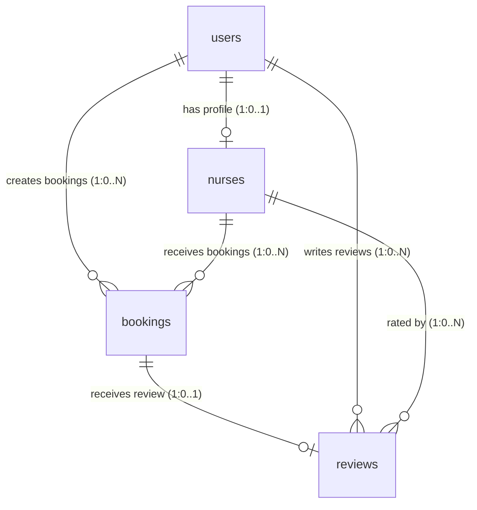
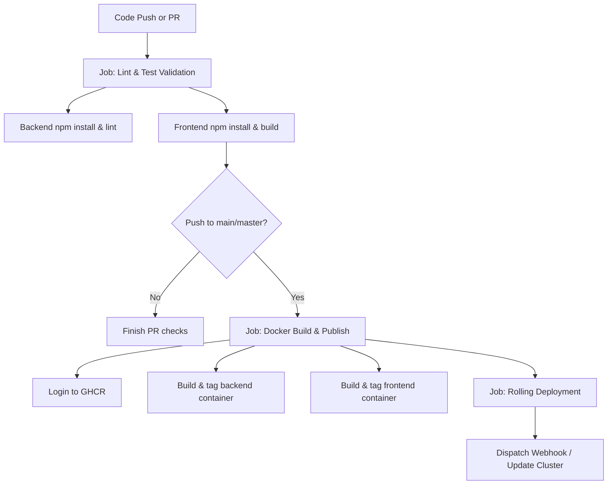

# Careos Engineering & Workflow Guide

Welcome to the **Careos Localized MVP** codebase. Careos is a full-stack platform designed to facilitate finding, evaluating, and booking qualified nurses for elderly in-home care. 

This document serves as the developer runbook, covering the directory layout, technology stack, database schema, API routing, design systems, local workflows, Docker setup, and CI/CD parameters.

---

## 1. Monorepo Repository Structure

The project is structured as a monorepo containing a React frontend and a Node.js Express backend.

```
careos-local/
├── .github/                 # GitHub Actions workflows
│   └── workflows/
│       └── ci-cd.yml        # Multi-stage CI/CD workflow definition
├── backend/                 # Node.js Express Backend Service
│   ├── src/
│   │   ├── config/          # Configurations (db.js, etc.)
│   │   ├── controllers/     # Business logic modules
│   │   ├── db/              # Relational schemas & seed scripts
│   │   │   ├── schema.sql   # Relational table models (SQLite)
│   │   │   └── seed.js      # Seed generator
│   │   ├── middleware/      # Auth & validation filters
│   │   ├── models/          # Data model interfaces
│   │   ├── routes/          # REST Endpoint groupings
│   │   └── server.js        # Main HTTP & Socket.io server script
│   ├── .env                 # Environment secrets template
│   ├── Dockerfile           # Production container compilation configuration
│   └── package.json
├── frontend/                # React Vite Frontend SPA
│   ├── public/              # Global assets
│   ├── src/
│   │   ├── assets/          # Static elements & images
│   │   ├── components/      # Reusable views & design tokens
│   │   │   ├── layout/      # Navbar, Footers, and Layouts
│   │   │   └── ui/          # Buttons, Modals, Inputs, Badges
│   │   ├── context/         # Auth & global state stores
│   │   ├── hooks/           # Custom React hooks
│   │   ├── pages/           # Landing, Directory, Auth, Booking, Dashboards
│   │   ├── utils/           # Client API client & utility logic
│   │   ├── App.css          # Core layouts
│   │   ├── App.jsx          # Router & Toast container
│   │   ├── index.css        # Tailwind v4 style tokens and theme variables
│   │   └── main.jsx         # Dom injector
│   ├── Dockerfile           # Nginx-based frontend runner config
│   ├── nginx.conf           # Reverse proxy configuration
│   └── package.json
├── docker-compose.yml       # Production-ready local multi-container orchestration
├── package.json             # Root monorepo workspace executor script
└── README.md                # General readme overview
```

---

## 2. Technology Stack

* **Frontend Framework**: React 19 + Vite 8.0 (Fast HMR compilation)
* **Frontend Router**: React Router DOM v7
* **Frontend Styling**: TailwindCSS v4.0 + Custom Utility classes (Vanilla CSS variables)
* **Animations**: Framer Motion for state and navigation micro-animations
* **Backend Runtime**: Node.js
* **Backend Framework**: Express.js 5.x (Modern request middleware handling)
* **Real-time Server**: Socket.io (WebSocket channels for instant bookings synchronization)
* **Database engine**: SQLite 3 (File-based local persistent SQL storage)
* **API Validation**: Zod (Schema-based body, query, and params validations)
* **Security & Auth**: JSON Web Tokens (JWT) for stateless validation, `bcryptjs` for encryption, and `helmet` for security headers.

---

## 3. Database Schema Definitions

Careos uses SQLite for simplicity, local performance, and minimal infrastructure overhead. **Foreign Key constraints are explicitly enabled** on database connections (`PRAGMA foreign_keys = ON;`).



### Table Structure Specifications

#### 1. `users` (Core Auth accounts)
* `id` (INTEGER, Primary Key, Auto-increment)
* `name` (TEXT, Not Null)
* `email` (TEXT, Not Null, Unique)
* `password_hash` (TEXT, Not Null)
* `role` (TEXT, Not Null, check constraints: `'family'`, `'nurse'`, `'admin'`)
* `is_admin` (INTEGER, Defaults to `0` for false, `1` for true)
* `created_at` (DATETIME, Defaults to current time)

#### 2. `nurses` (Caregivers registry)
* `id` (INTEGER, Primary Key, Auto-increment)
* `user_id` (INTEGER, Unique, Foreign Key referencing `users(id)` ON DELETE CASCADE)
* `specialties` (TEXT, Not Null, comma-separated specialties)
* `hourly_rate` (REAL, Not Null)
* `availability` (TEXT, Not Null, check constraints: `'Weekdays'`, `'Weekends'`, `'24/7'`)
* `experience_years` (INTEGER, Not Null)
* `avatar_url` (TEXT)
* `rating` (REAL, Defaults to `5.0`)
* `bio` (TEXT)
* `license_number` (TEXT)
* `verification_status` (TEXT, Defaults to `'pending'`, check: `'pending'`, `'under_review'`, `'verified'`, `'rejected'`)
* `verification_document_url` (TEXT)
* `rejection_reason` (TEXT)
* `created_at` (DATETIME, Defaults to current time)

#### 3. `bookings` (Scheduling records)
* `id` (INTEGER, Primary Key, Auto-increment)
* `user_id` (INTEGER, Foreign Key referencing `users(id)` ON DELETE CASCADE)
* `nurse_id` (INTEGER, Foreign Key referencing `nurses(id)` ON DELETE CASCADE)
* `start_date` (TEXT, Not Null, Format `YYYY-MM-DD`)
* `end_date` (TEXT, Not Null, Format `YYYY-MM-DD`)
* `hours_per_day` (INTEGER, Not Null)
* `total_price` (REAL, Not Null)
* `status` (TEXT, Defaults to `'pending'`, check: `'pending'`, `'approved'`, `'cancelled'`, `'completed'`)
* `has_reviewed` (INTEGER, Defaults to `0`, check: `0` or `1`)
* `created_at` (DATETIME, Defaults to current time)

#### 4. `reviews` (Feedback registry)
* `id` (INTEGER, Primary Key, Auto-increment)
* `booking_id` (INTEGER, Unique, Foreign Key referencing `bookings(id)` ON DELETE CASCADE)
* `user_id` (INTEGER, Foreign Key referencing `users(id)` ON DELETE CASCADE)
* `nurse_id` (INTEGER, Foreign Key referencing `nurses(id)` ON DELETE CASCADE)
* `rating` (INTEGER, Not Null, check: `1` to `5`)
* `comment` (TEXT, Not Null)
* `created_at` (DATETIME, Defaults to current time)

---

## 4. Local Development Lifecycle

### Prerequisites
* **Node.js**: v18.x or newer (recommended)
* **npm**: v8.x or newer

### Setup Steps

1. **Install All Workspace Dependencies**:
   From the project root directory, run the all-in-one setup command to install root tools (like `concurrently`), frontend packages, and backend dependencies:
   ```bash
   npm run setup
   ```

2. **Configure Local Environment**:
   * **Backend**: Create a `.env` in `backend/`:
     ```env
     PORT=3000
     JWT_SECRET=careos-secure-jwt-secret-key-38291
     DATABASE_PATH=database.sqlite
     ```
   * **Frontend**: Create a `.env.local` in `frontend/` if you need to point to a different API host (defaults to proxy target in `vite.config.js`):
     ```env
     VITE_API_URL=/api
     ```

3. **Start Coordinated Hot-Reloading Servers**:
   Launch both Express and Vite concurrently with:
   ```bash
   npm run dev
   ```
   * The backend will run on [http://localhost:3000](http://localhost:3000)
   * The frontend client will run on [http://localhost:5173](http://localhost:5173) (Vite proxies requests matching `/api/*` automatically to port 3000)

4. **Resetting/Seeding database**:
   The backend seeds the SQLite database (`backend/database.sqlite`) automatically on the first start if it's missing or empty. If you want to force reset and re-seed, run:
   ```bash
   # Kill the server
   rm backend/database.sqlite
   # Run again (autoseeds on startup)
   npm run dev
   ```
   Or run the seed script directly:
   ```bash
   npm run seed --prefix backend
   ```

---

## 5. Seed Accounts registry

Use these credentials to authenticate in various environments:

| Name | Role | Email | Password | Attribute |
| :--- | :--- | :--- | :--- | :--- |
| **Jane Smith** | `family` (Client) | `jane@example.com` | `password123` | Active Test Family account |
| **Moses** | `family` (Client) | `moses@example.com` | `password123` | Secondary Client Account |
| **Sarah Jenkins, RN** | `nurse` (Caregiver) | `sarah@example.com` | `password123` | Verified Nurse, Specialties: Dementia |
| **Michael Chang, LPN** | `nurse` (Caregiver) | `michael@example.com` | `password123` | Verified Nurse, Specialties: PT assistance |
| **Elena Rostova, RN** | `nurse` (Caregiver) | `elena@example.com` | `password123` | Verified Nurse, Specialties: Palliative Care |
| **James Carter** | `nurse` (Caregiver) | `james@example.com` | `password123` | Pending Verification Nurse Profile |
| **Careos System Admin** | `admin` (Staff) | `admin@example.com` | `password123` | Administrator (can verify/reject nurses) |

---

## 6. API Endpoint Inventory

All API endpoints reside under `/api/*`.

### Authentication Endpoints (`/api/auth`)

| Method | Endpoint | Authentication | Payload Schema | Success Code | Response Shape |
| :--- | :--- | :--- | :--- | :--- | :--- |
| **POST** | `/register` | Public | `{ name, email, password, role }` | `201` | `{ token, user: { id, name, email, role } }` |
| **POST** | `/login` | Public | `{ email, password }` | `200` | `{ token, user: { id, name, email, role } }` |
| **GET** | `/me` | JWT Bearer | None | `200` | `{ id, name, email, role, is_admin }` |

### Nurse Discovery & Profile Endpoints (`/api/nurses`)

| Method | Endpoint | Authentication | Payload Schema | Success Code | Response Shape |
| :--- | :--- | :--- | :--- | :--- | :--- |
| **GET** | `/` | Public | Query: `specialty, availability, maxRate` | `200` | `[ { id, name, specialties, hourly_rate, availability, rating } ]` |
| **GET** | `/profile` | JWT Bearer (Nurse) | None | `200` | `{ id, user_id, specialties, hourly_rate, availability, bio... }` |
| **PUT** | `/profile` | JWT Bearer (Nurse) | `{ specialties, hourly_rate, availability, experience_years, bio, license_number }` | `200` | `{ message: "Profile updated successfully.", profile }` |
| **POST** | `/verify` | JWT Bearer (Nurse) | `{ license_number, verification_document_url }` | `200` | `{ message: "Verification submitted." }` |
| **GET** | `/:id` | Public | Params: `id` (numeric) | `200` | `{ id, name, specialties, hourly_rate, experience_years, bio, license_number, rating, reviews: [] }` |
| **GET** | `/:id/reviews`| Public | Params: `id` (numeric) | `200` | `[ { id, comment, rating, created_at, family_name } ]` |

### Booking Lifecycle Endpoints (`/api/bookings`)

| Method | Endpoint | Authentication | Payload Schema (Zod Validated) | Success Code | Response Shape |
| :--- | :--- | :--- | :--- | :--- | :--- |
| **POST** | `/` | JWT Bearer (Family) | `{ nurse_id, start_date, end_date, hours_per_day }` | `201` | `{ message: "Booking created successfully.", booking: { id, total_price, status... } }` |
| **GET** | `/` | JWT Bearer | None | `200` | `[ { id, start_date, end_date, hours_per_day, total_price, status, nurse_name/family_name } ]` |
| **PATCH**| `/:id` | JWT Bearer | `{ status: ('approved' \| 'cancelled' \| 'completed') }` | `200` | `{ message: "Booking status updated.", booking }` |
| **POST** | `/:id/reviews`| JWT Bearer (Family) | `{ rating: 1..5, comment }` | `201` | `{ message: "Review submitted.", review }` |

### Admin Operational Endpoints (`/api/admin`)

| Method | Endpoint | Authentication | Payload Schema | Success Code | Response Shape |
| :--- | :--- | :--- | :--- | :--- | :--- |
| **GET** | `/stats` | JWT Admin | None | `200` | `{ totals: { families, nurses, bookings }, stats: { totalVolume... } }` |
| **GET** | `/pending-nurses`| JWT Admin | None | `200` | `[ { id, name, license_number, verification_status } ]` |
| **PATCH**| `/verify-nurse/:id`| JWT Admin | `{ status: ('verified' \| 'rejected'), rejection_reason }` | `200` | `{ message: "Nurse status updated." }` |

---

## 7. Real-time Events Architecture

Careos implements instant synchronization between user dashboards using **Socket.io**.
* **Namespace**: Default `/` root server socket.
* **Controller usage**: The backend server injects the `io` instance into Express requests via `req.io`.
* **Emitted Channel**: `booking_updated` with payload:
  ```json
  {
    "type": "STATUS_CHANGE",
    "bookingId": 12,
    "status": "approved",
    "userId": 5, 
    "nurseId": 3
  }
  ```
* **Frontend React Hook**: Client connects inside the context or dashboard, registers listener on `booking_updated`, and triggers a toast notification + data refetch when matching user context parameters.

---

## 8. Frontend Design & Styling Guidelines

Careos is crafted with **Warm-Empathetic and Modern Glassmorphic** UI parameters. The layout is designed to avoid sterile, clinical interfaces by relying on soft, reassuring colors.

### CSS Theme Setup (Tailwind v4 `@theme`)

Theme properties are injected through CSS custom variables:

* **Background Ambient Canvas (`--color-brand-bg`)**: `#fefcf8` (warm alabaster cream - reduces clinic sterile feeling)
* **Primary Branding Anchor (`--color-brand-primary`)**: `#0f766e` (deep sage/pine teal - denotes health, trust, and care)
* **Secondary Comfort Anchor (`--color-brand-secondary`)**: `#d97706` (warm soft ochre/amber - denotes comfort and safety)
* **Text Main Ink (`--color-text-main`)**: `#2c2a29` (warm charcoal - softer readability than absolute black)
* **Text Muted Ink (`--color-text-muted`)**: `#6b6661` (muted clay gray)

### Reusable Custom Class Utilities

Always use these custom classes instead of styling from scratch to maintain aesthetics:

1. **Film Grain Texture (`.grain-overlay`)**: Creates an organic, premium material look overlaying the page.
2. **Glow Mesh (`.bg-glow-mesh`)**: Generates an elegant, moving, fluid multi-radial background gradient.
3. **Glassmorphism Card (`.glass-card` / `.glass-card-premium`)**:
   ```css
   .glass-card {
     background: rgba(255, 255, 255, 0.75);
     backdrop-filter: blur(24px) saturate(200%);
     border: 1px solid rgba(255, 255, 255, 0.8);
     box-shadow: 0 10px 40px -10px rgba(15, 23, 42, 0.05);
   }
   ```
4. **Dynamic Fluid Hover (`.glass-card-hover`)**: Adds subtle skewing, elevation, border shifts, and glowing reflections on hover to make elements look responsive.
5. **Interactive Glow Cursor (`.cursor-light`)**: Generates a mouse-tracking soft backlight light emitter on desktop viewport devices.

---

## 9. Multi-Container Production Stack (Docker)

To test build integrity locally as if running in production, use the multi-container configuration.

* **Build Commands**:
  ```bash
  # Start the complete system (frontend + backend) in detached mode
  docker-compose up -d --build
  ```
* **Ports Exposed**:
  * **Frontend web client**: [http://localhost:8080](http://localhost:8080) (proxied and served via Nginx)
  * **Backend REST API**: [http://localhost:3000](http://localhost:3000)
* **Volume Persistence**:
  SQLite db persists through a local volume map named `sqlite-data` mapping inside `/app/data/` of the backend container, preventing database wipes on restarts.

---

## 10. Automated CI/CD Pipeline

The GitHub Actions workflow `.github/workflows/ci-cd.yml` automates code validation and deployment:



1. **Validation Phase**: Lint checks, dependency installs, and production compilation test for frontend to ensure zero compilation regressions.
2. **Build and Tag Phase**: Builds Docker images with commit SHA tags and uploads them to GitHub Container Registry (`ghcr.io`).
3. **Deployment Phase**: Emits webhooks or triggers updates to deploy target servers.

---

## 11. Engineering Guidelines & Workflow Rules

When working on this repository, strictly adhere to the following rules:

### A. Git Branching Model
* Never commit directly to `main` or `master`.
* Create descriptive topic branches:
  * Features: `feature/short-description`
  * Bugfixes: `bugfix/issue-id-short-description`
  * Hotfixes: `hotfix/urgent-patch`
* Write clean, atomic commits:
  ```
  feat(bookings): implement live status update toast handler
  fix(auth): correct schema validation rejection for short names
  ```

### B. Code Quality & Formatting
* **Linting**: Keep code green. Run `npm run lint` in the frontend and correct any issues.
* **TypeScript & Interfaces**: If TypeScript integration is added, enforce clean interfaces instead of generic `any`.
* **Zod validation**: Ensure every input from the user (request params, query, body) is validated via Zod schemas inside the routes definitions before hitting the controllers.
* **Error management**: Always write catch blocks that pass exceptions to the `next` handler. Never throw uncaught exceptions that could crash the Express instance.

### C. UI Aesthetics Constraints
* **No ad-hoc utility styling**: Rely on core theme properties inside `index.css`.
* **Micro-animations**: Use Framer Motion or custom transitions on every interactive action (hover states, modal entry, page shifts).
* **Responsive Layouts**: Design for mobile viewports up to large screen monitors. Use CSS grids or flexbox with tailwind breakpoint rules.
